# Dynatrace connector for Raycast

> Monitor your Dynatrace environment directly from Raycast — search logs, track problems, inspect deployments and entities, all without leaving your keyboard.

## Features

- 🔍 **Search Logs** — Query Dynatrace Grail logs with DQL filters, timeframe presets, and service-level drill-down
- 🚨 **Active Problems** — View open Davis AI problems with severity color-coding and deep-links
- 🚀 **Recent Deployments** — Browse deployment events and correlate with incidents and errors
- 🏷 **Find Entity** — Search services, hosts, and process groups by name
- ⚡ **Run DQL Query** — Execute any arbitrary DQL query and view results dynamically
- 💾 **Saved DQL Queries** — Maintain a personal library of frequently used DQL queries
- 🖥 **Menu Bar Problems** — Ambient problem counter in the macOS status bar, refreshed every 5 minutes

## Setup

### 1. Create OAuth credentials in Dynatrace

1. Open your Dynatrace environment → **Settings** → **IAM** → **OAuth Clients**
2. Create a new client with the following scopes:
   - `storage:logs:read`
   - `storage:problems:read`
   - `storage:events:read`
   - `entity:read`
3. Note your **Client ID**, **Client Secret**, and **SSO endpoint**

### 2. Add your first tenant

1. Open Raycast and run **Manage Tenants**
2. Click **Add Tenant** and fill in:
   - **Name** — a friendly label (e.g. "Production")
   - **Tenant Endpoint** — e.g. `https://abc123.live.dynatrace.com`
   - **Client ID** and **Client Secret** from step 1
   - **SSO Endpoint** — default is `https://sso.dynatrace.com/sso/oauth2/token`
   - **Scopes** — space-separated list from step 1
3. Save and set the tenant as **Active**

### 3. Run any command

Open Raycast, type **Search Logs**, **Active Problems**, or any other Dynatrace command. The extension will automatically obtain an OAuth token and query your tenant.

## Commands

| Command | Description |
|---|---|
| Search Logs | Query Grail logs with DQL filters, service dropdown and timeframe presets |
| Active Problems | View open Davis AI problems with severity levels and correlation actions |
| Recent Deployments | Browse deployment events; jump to related problems or errors |
| Find Entity | Search services, hosts and process groups by name |
| Run DQL Query | Execute a custom DQL statement and inspect results |
| Saved DQL Queries | Manage and run a personal library of DQL queries |
| Manage Tenants | Add, edit and switch between Dynatrace tenants |
| Problems in Menu Bar | Ambient open-problem counter in the macOS menu bar |

## Screenshots

### Search Logs
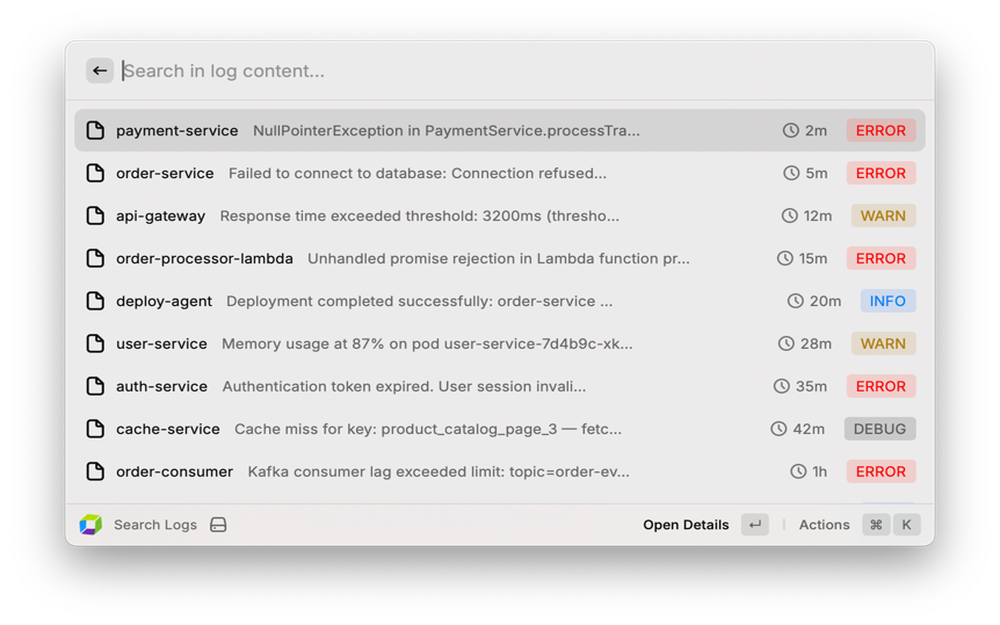
Query Dynatrace Grail logs with DQL filters, service-level drill-down, and timeframe presets.

### Active Problems
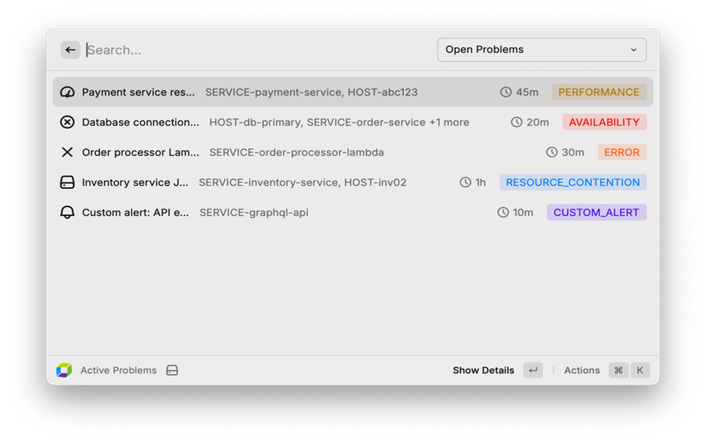
View open Davis AI problems with severity color-coding, affected entities, and deep-links to Dynatrace.

### Log Detail View
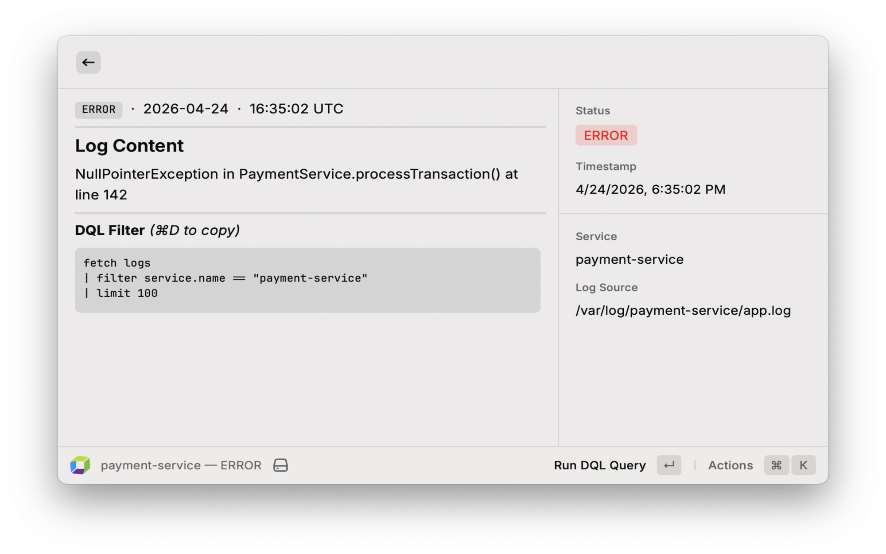
Inspect log records with pretty-printed JSON, stack trace formatting, and related logs actions.

### Run DQL Query
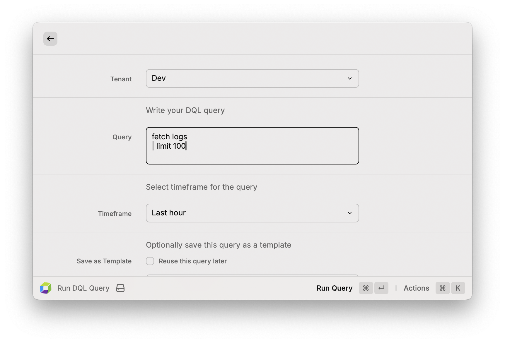
Execute arbitrary DQL queries, view results in dynamic tables, and save frequently used queries.

### DQL Result Detail
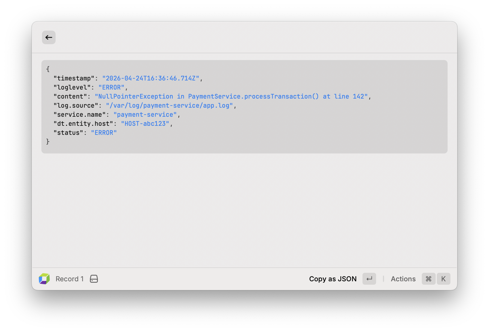
Inspect individual DQL result records as pretty-printed JSON with a one-click "Copy as JSON" action.

### Problem Detail View
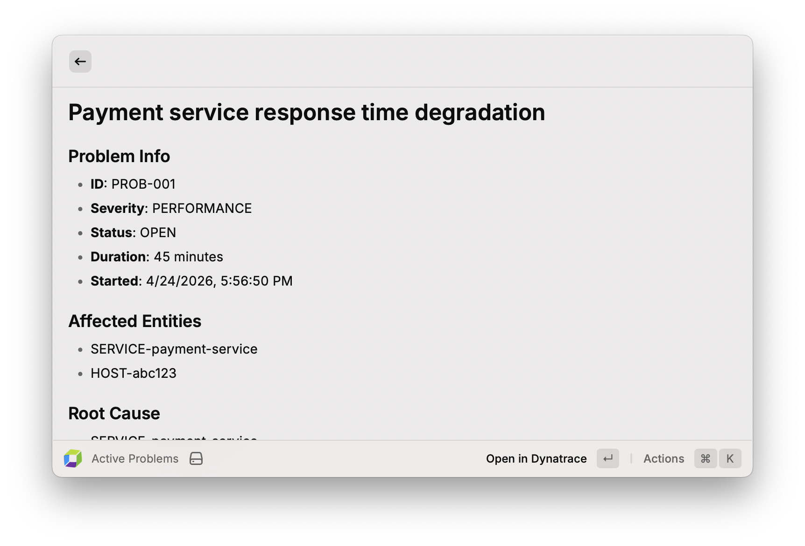
Drill into any Davis AI problem to see its ID, severity, status, duration, affected entities, and root cause. Open directly in Dynatrace with a single action.

### AI Log Explanation
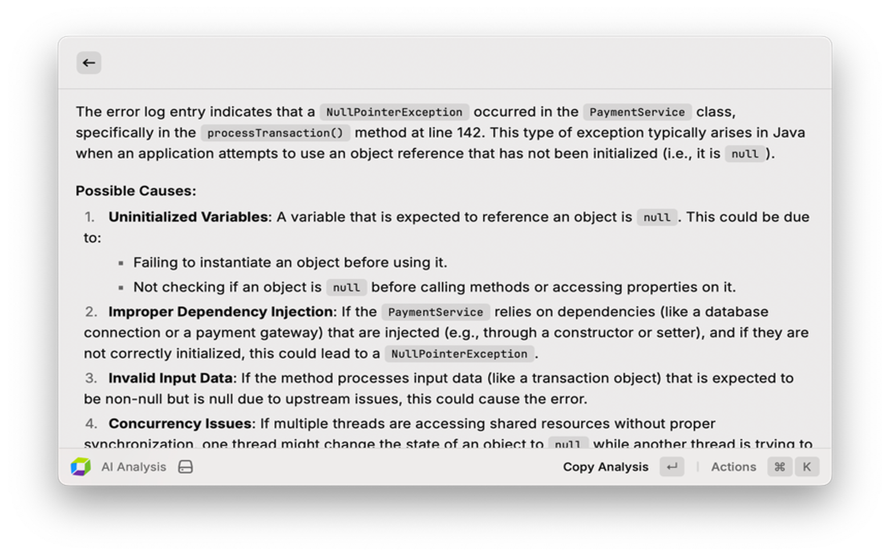
Get an instant AI-generated explanation of a log error — possible causes, dependency issues, and next steps — without leaving Raycast.

### Jira Ticket Creation
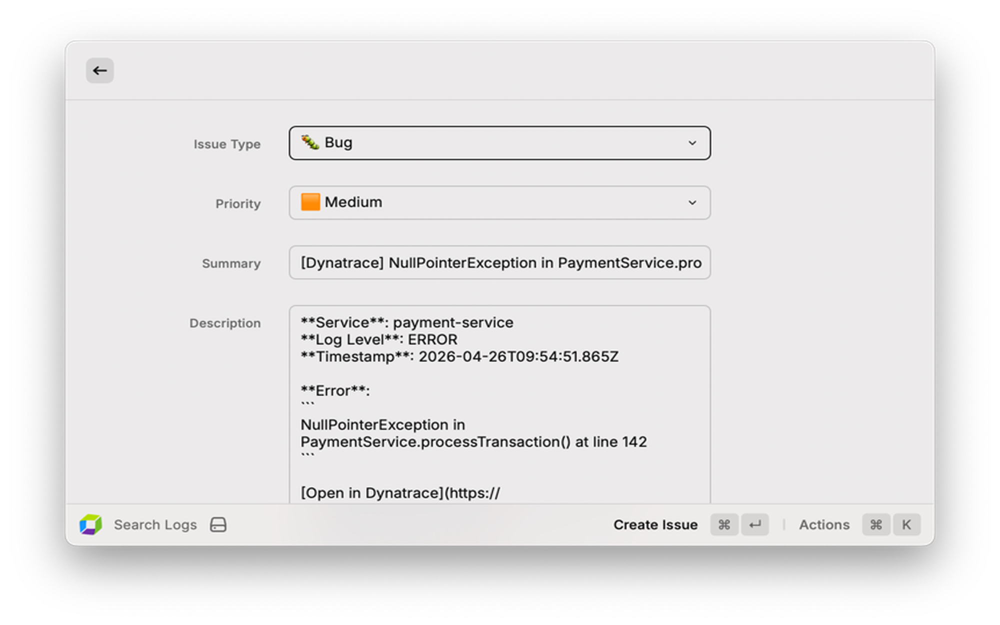
Create a Jira issue pre-filled with service name, log level, timestamp, and error content directly from any log record.

### Menu Bar Problems
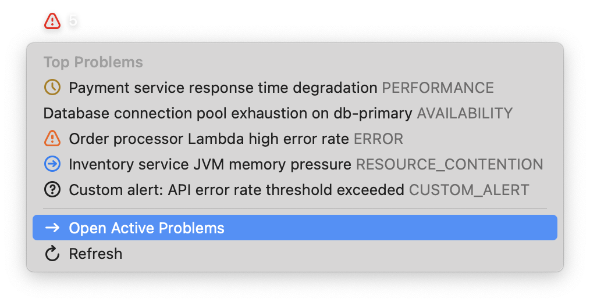
A persistent menu bar counter shows the number of open problems, refreshed every 5 minutes. Click to see the top problems by severity and jump straight to Active Problems.

### Manage Tenants
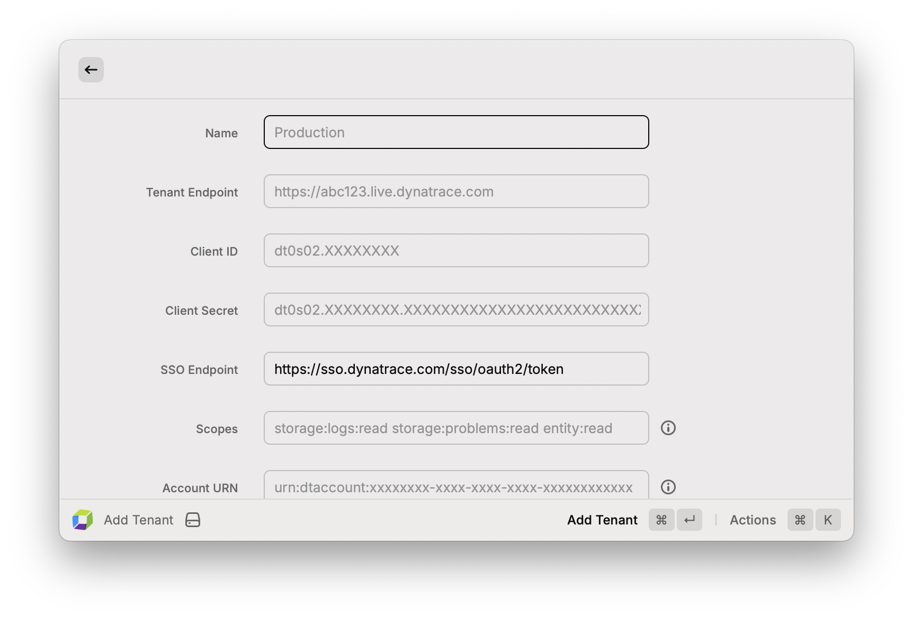
Add and switch between multiple Dynatrace environments with OAuth 2.0 authentication.

### Recent Deployments
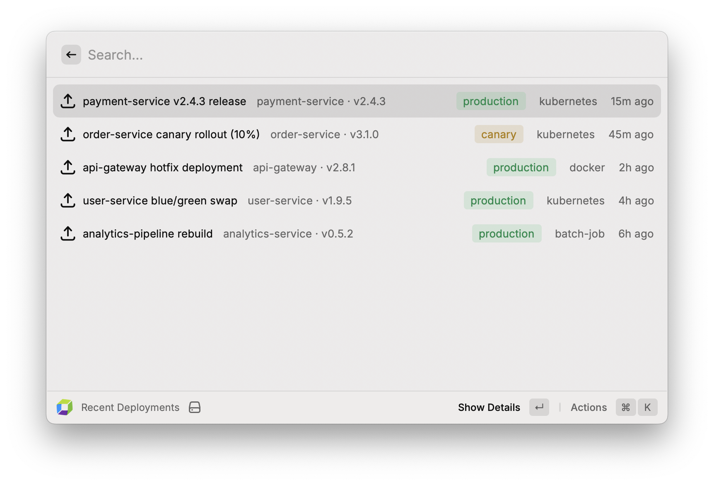
Browse deployment events and correlate with incidents and errors in your environment.

## Contributing

1. Fork this repository and create a feature branch
2. Run `npm install` to install dependencies
3. Run `npm run dev` to start the Raycast development server
4. Make your changes and ensure `npm run lint` and `npm run build` pass
5. Open a pull request — the CI pipeline will run lint, build and tests automatically
